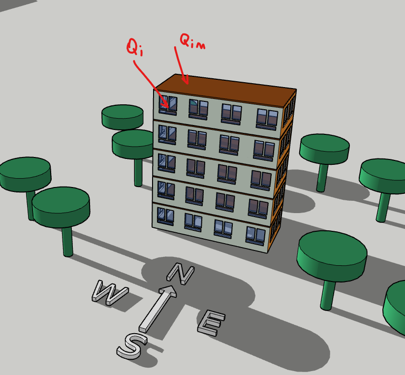

## Расчет теплопоступлений от солнечной радиации для расчета нагрузок систем кондиционирования

---
title: "Расчет теплопоступлений от солнечной радиации для расчета нагрузок систем кондиционирования"
subtitle: "Краткое описание методики расчета теплопоступлений от солнечной радиации и опыт разработки программы расчета для автоматизации"
author: "Донченко Михаил Александрович"
date: "ГГГГ-ММ-ДД"
tags:
  - тег1
  - тег2
  - тег3
---

## Аннотация

В статье рассматривается проблема расчёта теплопоступлений от солнечной радиации в системах ОВиК: традиционные методики, описанные в $[1]$, отличаются высокой сложностью для реализации в табличных программах, а упрощённые подходы через удельные нагрузки приводят к потере физического смысла процесса.

Цель исследования — продемонстрировать эффективность применения средств программирования для автоматизации расчёта теплопоступлений. В качестве инструмента выбран язык Python.

Методология включает:
- формализацию структуры расчёта теплопоступлений;
- пошаговую реализацию отдельных расчётных функций на Python;
- интеграцию функций в единую расчётную схему.

Основные результаты:

- разработана программная реализация алгоритма расчёта теплопоступлений от солнечной радиации;
- показана возможность ускорения расчётов без потери точности;
- предложен подход, сохраняющий физический смысл процесса и позволяющий гибко учитывать исходные параметры.

Практическая значимость работы заключается в предоставлении инженерам‑проектировщикам ОВиК инструмента для быстрого и корректного расчёта теплопоступлений, что повышает точность проектирования систем кондиционирования и снижает риск ошибок на этапе подбора оборудования.

Ключевые слова: теплопоступления, солнечная радиация, ОВиК, Python, проектирование систем кондиционирования.

## Введение

<!-- * Обоснование актуальности темы. -->

При разработке инженерами-проектировщиками ОВиК систем кондиционирования для различных зданий требуется выполнить расчеты теплопоступлений в помещения от различных источников в т.ч. от солнечной радиации. 
Расчет теплопоступлений от солнечной радиации, описанный в $[1]$ достаточно массивный и сложный для выполнения его в табличных программах. 

<!-- * Постановка проблемы. -->

В результате многие проектировщики прибегают к упрощенным методикам расчета через удельные нагрузки, определенные различными способами, для ускорения расчетов ценой потери физического смысла процесса.

<!-- * Цели и задачи статьи. -->

Целью данной статьи является привеасти пример использования средств программирования для решения такой задачи.

<!-- * Краткий обзор структуры статьи. -->

Вначале опишем структуру расчета теплопоступлений. 
Затем опишем последовательно метод расчета на Python отдельных функций и покажем, как это может в дальнейшем использоваться.

## Основная часть

### Раздел 1. Описание структуры расчета теплопоступлений

На основании метода из Пособия $[1]$ опишем структуру расчета.

Поступления теплоты Q, Вт, в помещения от солнечной радиации определяется по формуле: 

$$
Q = \sum\limits_{i=1}^a Q_i + \sum\limits_{i=1}^b Q_im \tag{1}
$$
- Q_i -  тепловой поток через i-й световое проем, Вт;
- Q_im - тепловой поток через i-й массивное ограждение, Вт;
- a - число световых проемов;
- b - число массивных ограждений;

*В данной работе рассмотрим только первую часть данной формулы - теплопоступления теплового потока через световые проемы(окна, фасадные системы и т.п.). Дополнение расчета учитыванием теплопоступлений через массивные ограждения - (стены, крышу) будем выполнять в отдельной работе.*



*Рисунок 1. Описание рисунка.*

Тепловой поток прямой и рассеянной солнечной радиации (далее "солнечной радиации") через i-й световой остекленный проем (далее "световой проем"), Вт, следует определять по формуле:

$$
Q_{sun} = Q_{sun,i} \cdot a_d + Q_{\delta t} \tag{2}
$$

- $Q_{sun}$ тепловой поток, Вт, солнечной радиации через остекленный световой проем, определяемый по п.п. 4-9;\
- a_d - показатель поглощения теплового потока солнечной радиации, определяемый по п.п. 10-12;\
- $Q_{\delta t}$ - тепловой поток теплопередачей через световой проем по п. 13.\


### Раздел 2. Реализация расчетных функций 


### Раздел 3. Использование на конкретном примере


### Раздел 4. Результаты

### Подраздел 1.1. Название подраздела


Текст подраздела. Формулы оформляются в LaTeX:

$$
E = mc^{2}
$$

Таблицы:

| Параметр | Значение | Единица измерения |
|--------|----------|------------------|
| Масса   | $m$      | кг               |
| Скорость| $v$      | м/с              |
| Энергия | $E$      | Дж               |

Рисунки:


*Рисунок 1. Описание рисунка.*

Списки:

1. Первый пункт нумерованного списка.
2. Второй пункт.
3. Третий пункт.

Или маркированный список:

* Пункт 1.
* Пункт 2.
* Пункт 3.

### Раздел 2. Название раздела

Продолжение основной части. При необходимости — дополнительные подразделы.

## Заключение

* Краткое резюме основных результатов.
* Выводы.
* Перспективы дальнейших исследований/разработок.
* Практическое применение результатов (если есть).

## Благодарности (опционально)

Выражение благодарности коллегам, организациям, фондам и т. п., оказавшим поддержку при подготовке статьи.

## Список литературы

1. "ПОСОБИЕ 2.91 к СНиП 2.04.05-91 - Расчет поступления теплоты солнечной радиации в помещения", Москва 1993 г.

1. Фамилия И. О. Название работы. — Город: Издательство, год. — 300 с.
2. Фамилия И. О., Фамилия И. О. Название статьи // Название журнала. — Год. — Т. 10. — № 2. — С. 15–25.
3. Автор. Название веб‑ресурса [Электронный ресурс]. URL: https://example.com (дата обращения: ДД.ММ.ГГГГ).
4. Doe J., Smith A. Title of the Paper // Journal Name. — 2023. — Vol. 15. — No. 3. — P. 123–135.
5. Organization Name. Report Title. — Year. — URL: https://example.org (accessed: DD.MM.YYYY).

## Приложения (опционально)

Дополнительные материалы, не вошедшие в основной текст:
* большие таблицы;
* исходный код;
* дополнительные расчёты;
* опросники и т. п.

*Приложение A. Название приложения.*

Текст приложения.
```

---

## Пояснения к шаблону

**1. Front Matter (метаданные в YAML):**
* `title` — заголовок статьи;
* `subtitle` — подзаголовок (не обязательно);
* `author` — автор(ы);
* `date` — дата публикации;
* `tags` — теги для категоризации;
* `bibliography` — путь к файлу библиографии (если используете BibTeX).

**2. Оформление ссылок:**
* В тексте — квадратные скобки с номером: $[1]$, $[2, 3]$, $[4–6]$.
* В списке литературы — нумерованный список по порядку упоминания или по алфавиту.

**3. Формулы:**
* Используются синтаксис LaTeX: `$inline formula$` для встроенных и `$$block formula$$` для выделенных.

**4. Рисунки:**
* Подпись под рисунком — после изображения.
* Нумерация рисунков сквозная.

**5. Таблицы:**
* Заголовок таблицы — над таблицей.
* Шапка таблицы — первая строка.

**6. Список литературы:**
* Оформляется в соответствии с выбранным стилем (ГОСТ, APA, MLA, Chicago и т. д.).
* Источники нумеруются.

**7. Приложения:**
* Каждое приложение имеет буквенное обозначение (A, B, C и т. д.) и заголовок.
* Ссылки на приложения в тексте: *см. Приложение A*.

